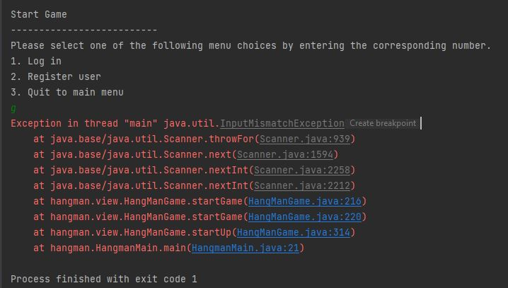
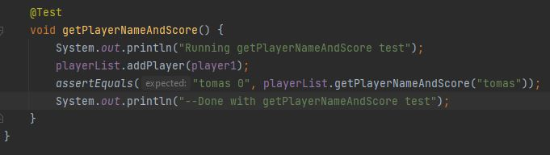
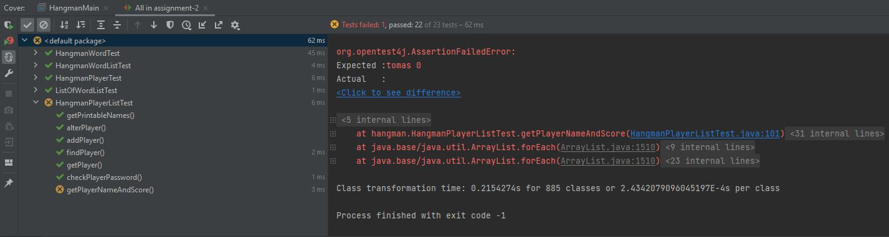
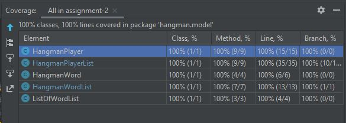

Revision History
================

Table , Table for revisions updates for this document

| Date       | Version | Description                                                             | Author                      |
|------------|---------|-------------------------------------------------------------------------|-----------------------------|
| 03/02/2020 | v1.0    | First presentation of project plan                                      | Tomas Marx-Raacz von Hidvég |
| 05/03/2020 | v.1.1   | Redesigned and altered project plan                                     | Tomas Marx-Raacz von Hidvég |
| 05/03/2020 | v.2     | Updated iterations, schedule and timelog                                | Tomas Marx-Raacz von Hidvég |
| 24/08/2021 | v.3     | Updated iterations, schedule for test-plan and test-execution           | Tomas Marx-Raacz von Hidvég |
| 26/08/2021 | v.4     | Updated iterations, schedule for final step, final submissions chapter. | Tomas Marx-Raacz von Hidvég |

General information
===================

Table , Table containing general project information

| 2.1 Project Summary |                                                                                                                                                                                                                                                                                                                                                                                                                                                                                                                                                                                                                                                                                             |
|---------------------|---------------------------------------------------------------------------------------------------------------------------------------------------------------------------------------------------------------------------------------------------------------------------------------------------------------------------------------------------------------------------------------------------------------------------------------------------------------------------------------------------------------------------------------------------------------------------------------------------------------------------------------------------------------------------------------------|
| Project Name        | Hangman                                                                                                                                                                                                                                                                                                                                                                                                                                                                                                                                                                                                                                                                                     |
| Project ID          | 1DV600/tendn09                                                                                                                                                                                                                                                                                                                                                                                                                                                                                                                                                                                                                                                                              |
| Project Manager     | [Tomas Marx-Raacz von Hidvég](mailto:tendn09@student.lnu.se)                                                                                                                                                                                                                                                                                                                                                                                                                                                                                                                                                                                                                                |
| Main Client         | End user                                                                                                                                                                                                                                                                                                                                                                                                                                                                                                                                                                                                                                                                                    |
| Key Stakeholders    | End user [Administrator](mailto:tobias.olsson@lnu.se) Teachers Developers                                                                                                                                                                                                                                                                                                                                                                                                                                                                                                                                                                                                                   |
| Executive Summary   | The application is going to be a Hangman Game with                                                                                                                                                                                                                                                                                                                                                                                                                                                                                                                                                                                                                                          |
|                     | some additional functionality like the inclusion of a system                                                                                                                                                                                                                                                                                                                                                                                                                                                                                                                                                                                                                                |
|                     | for importing wordlists for the game to run upon and                                                                                                                                                                                                                                                                                                                                                                                                                                                                                                                                                                                                                                        |
|                     | a basic user control system with a score system applied to                                                                                                                                                                                                                                                                                                                                                                                                                                                                                                                                                                                                                                  |
|                     | it. This score in turn will be added to a high score list that                                                                                                                                                                                                                                                                                                                                                                                                                                                                                                                                                                                                                              |
|                     | users will be able to access.                                                                                                                                                                                                                                                                                                                                                                                                                                                                                                                                                                                                                                                               |
|                     |                                                                                                                                                                                                                                                                                                                                                                                                                                                                                                                                                                                                                                                                                             |
|                     | The application is going to be created using an pseudo Agile                                                                                                                                                                                                                                                                                                                                                                                                                                                                                                                                                                                                                                |
|                     | methodology but with some additional planning put into it.                                                                                                                                                                                                                                                                                                                                                                                                                                                                                                                                                                                                                                  |
|                     |                                                                                                                                                                                                                                                                                                                                                                                                                                                                                                                                                                                                                                                                                             |
|                     | It is going to be created through 4 iterations: The establishment of this plan. Modelling and implementing the software. Testing the software. Finishing touches and delivery. The software is going to be produced as a Java terminal applet.                                                                                                                                                                                                                                                                                                                                                                                                                                              |

Vision
======

The vision of this project is not and have never been to reinvent the wheel.
What we are currently making is a command console version of the hangman game
with the expected functionality one would want from a hanged man game. What
gives our game an extra touch in this case is that we choose to include a system
of exchanging lists of words in the program so that one can apply this game for
word-knowledge in school. This will be a simple task for a school administrator
to put a text file(.txt) with a new line delimiter between the words into a
folder and through our application import it to the program. In the first final
product of this game this will be limited to the use of basic words using the
English alphabet, but in future updates this might be altered and extended.
There will also be a high score list where the end user, in our case mostly
students in the lower grades to amass points for finished words as a further
gratification in their word knowledge studies.

The task of making learning fun for our young ones have never been an easy one,
the intention of this project is to take yet another small step in that
direction.

4. Project Plan
===============

1.  Project Plan assignment reflection:  
    So where to start? I can start with stating that it was a lot more work that
    had to be put into this than I was planning on. I have studied quite some
    years in my life and finished a lot of courses and this is by far the
    biggest assignment I’ve ever created as a two-week assignment.  
      
    As a matter of fact it has the same text mass as my 2nd year essay in
    Archaeology which was limited to 15 pages, and we had 10 weeks for that.  
      
    Motivation did not get a great start when my friends who are developers
    actually laughed and asked why they made us read all this, “because no one
    ever uses it in real life”  
      
    That being said I have learned a lot throughout this process, especially
    about my own limitations and what is needed to create a large scope piece of
    software. And even if it is not being used to the extent that we are using
    it here, but rather in a very limited/scaled down version, it is clear that
    you gain a lot from knowing how it is supposed to be made(like Jesper
    Andersson says in the lectures).

4.1. Introduction
-----------------

The purpose of this project is to learn how to plan, schedule and develop a
hangman game (in general terms any type of software) along with different steps
that come with it. During this project the manager and developer (namely me)
will deploy the numerous models and tactics that is required to take to make
this plan as solid and dependable as possible.

The full timeframe of the project is 10 weeks.

4.2. Justification 
-------------------

The application is created mainly for lower grade students and it is created to
be simple, easy to understand, very light weight and due to our system for
teachers and other administrators to import new wordlists it will also be very
reusable. The high score system will also encourage students and other users to
use it multiple times in their quest for word knowledge.

4.3. Stakeholders 
------------------

The possible external stakeholders of this system are first and foremost the
end-user/student, the one that will play the game. Secondary stakeholders in
this will be the parents/administrators that will manage the wordlist import for
the system.

In some cases, these two groups can be the same person, but we are working with
the assumption that they are not.

The application is a game and as such it is an end-user-oriented program and not
connected to any kind of business system or critical hardware to control.

Internal stakeholders in this project is the combined Project manager and
developer that is responsible for the creation of the software.

4.4. Resources 
---------------

### 4.4.1. Planning and human resources

As for the resources used the human resources is in the form of the project
manager, who is also the projects lone developer. As such the need for effective
communication channels is not going to be an issue. If need be other developers
and designers might be queried in detail issues but in all this project is a one
man show.

The development team and plan are going to be setup in a pseudo agile project
approach with this plan as base but with a more flexible onlook on the
development. The work is going to be divided into iterations and plans will
naturally evolve as both plan, model, development issues and additional
functionality ideas arise.

As the target audience of this product is end-users the amount of outside input
and requirement changes is going to be low and as such this type of plan is more
likely to work.

### 4.4.2. Equipment resources

Work on this project is going to be designed and executed on a stationary PC
with windows 10 pro OS. On top of this a laptop backup using the same
environment except OS being home edition is going to be used simply to avoid any
time delays due to hardware breakdown.

IntelliJ IDE and AdoptOpen JDK 13(Oracle JDK v. 13 on laptop) are used as the
main development kit and <https://online.visual-paradigm.com/> web based UML
design tool for models.  
Microsoft Office 365 with a markdown plugin is being used for document creation.

### 4.4.3. Literature resources

**Book for design research:**

Sommerville, Ian. *Software Engineering*, 10th edition. Harlow: Pearson
Education Limited, 2016

**Links for design research:**

<http://agilemodeling.com/artifacts/constraint.htm> (Accessed 25/02/2020)  
<https://projectbliss.net/project-assumptions-list/> (Accessed 25/02/2020)

**Book for Java code research:**

Liang, Y. David. *Introduction to Java Programming and Data Structures,
Comprehensive version*, 11th Global edition. Harlow: Pearson Education Limited,
2019

### 4.4.4. Time resources

When it comes to time a project manager/developer like in this case would be
working with a 40-hour work week. This specific individual however is involved
with two other projects as well (1dv507 and an actual half time job). This
subject will be further investigated when discussing potential risks in chapter
6.

In a best case scenario, it would be the case that this project will receive in
the regions of 10-20 hours per week, averaging on 15 with some overtime run into
the mix.

4.5. Requirements
-----------------

### 4.5.1. Functional Requirements

-   Functionality should include what one would expect from a basic the hangman
    game with the guessing of letters to complete a word, wrong guess will lower
    the number of tries and right guess should exchange a blank line with the
    corresponding letter of the word.

-   User control. Each user should be able to create a username and password,
    this should create a user instance which should be connected to the high
    score list cumulatively with the help of text files.

-   User score. The user score should be calculated by adding up the number of
    tries left the user will have when finishing a word in the game.

-   High score list. Should be connected to the users, it should view the 10
    highest scoring members on the local machine.

-   Admin control. There should be a provided admin login (basic “admin” and
    “1234”) and the ability to create new admin users and modify their own info.
    Admin accounts should be used for import of new wordlists to improve reuse
    of the software.

### 4.5.2. Non-functional Requirements

Some of the standard Non-functional requirements are simply not going to be
prioritized due to very low impact on the system, these are:

-   *Portability* for example will not have a big impact on this application,
    being a computer command console application. The closest to a portable
    device this system is going to run on is a laptop computer.

-   *Security*, this is a single computer application without connection to any
    network or any other system resource par the operating system. Henceforth
    the only risk to the software will be from local manipulation of saved files
    (wordlists, user lists, admin lists) These latter two will however be
    somewhat encrypted but can still be manipulated through the file explorer.

-   *Scalability* and *maintenance*, this is not a system that has much room to
    expand par the import of new wordlists to choose from and as such it will
    remain small in pure maintenance perspective as well.

The focus of the requirements should instead be turned towards the following:

-   *Reliability*, the system should run successfully by a young student, 1st to
    6th grade and as such instructions should be clear and error codes should be
    posted in an understandable way so that the student can correct his error.

-   *Reusability*, the system, by implementing the import of new wordlists
    should make this system very reusable and therefor increase the lifecycle of
    this system in word studies. Furthermore, future upgrades could add more
    *flexibility* by improving the system to accept other alphabets to expand
    the program into learning other languages.

-   *Performance*, by using effective data structure components for this
    application the performance should be kept to a very fast standard. The
    software being command console/terminal based is also adding to this
    concept, no graphics or cluttering extras will be considered. The low
    performance demands of this software should also make it run smoothly on a
    less powerful system.

### 4.5.3. Hardware and Software requirements

-   Hardware requirements for the developers should be a decently powerful
    machine to account for coding mishaps, avoid infinite loop memory crashes
    and such issues that can delay the work if caught unattended.

-   Hardware requirements for a user is not really an issue for this program
    because it is so light weight. Enough hard drive space for OS, JRE and about
    10mb for the application and all the word lists in the world would suffice.

-   Software requirements for Developers will be to have a Java based IDE and a
    JDK of version 14

-   Software requirements for Users should be a command console (cmd for windows
    10) with the latest JRE (v.8u241) installed. For windows 10 a JRE is already
    included in the install(<https://java.com/sv/download/faq/win10_faq.xml>)  
    Otherwise the latest JRE should be downloaded and installed.

4.6. Overall Project Schedule 
------------------------------

### 4.6.1. Project Plan

Table , Table depicting the schedule for iteration 1 and projected time needed

| Task                                                                                                           | Estimated time            |
|----------------------------------------------------------------------------------------------------------------|---------------------------|
| Information gathering and reading up on the process of planning a system of this scale                         | 3 workdays (8 hours each) |
| Writing Vision and Project plan chapters                                                                       | 1 workday                 |
| Writing Iteration and requirements chapters                                                                    | 1 workday                 |
| Implementing file structure and skeleton code                                                                  | ½ workday                 |
| Fixing visual design of project plan document, writing time-log and applying finishing touches to the document | ½ workday                 |
|                                                                                                                |                           |
|                                                                                                                |                           |

Deadline is set to 2020-02-03

### 4.6.2. Modelling and Software Design

Table , Table depicting the schedule for iteration 2 and projected time needed

| Researching modelling and software design                                              | 4 workdays  |
|----------------------------------------------------------------------------------------|-------------|
| Creating use case diagram and descriptions                                             | ½ workday   |
| Creating State machine diagrams                                                        | ½ workday   |
| Implementing classes and main software menu and game system and creating class diagram | 1 ½ workday |
| Updating Project plan iteration, schedule and time-log                                 | 2 hours     |

Deadline is set to 2020-02-24 for the combination of this step and the one prior
to it.

### 4.6.3. Software Testing

Table , Table depicting the schedule for iteration 3 and projected time needed

| Researching software testing.                                     | 1 workday |
|-------------------------------------------------------------------|-----------|
| Importing project, re-orientation, and slight refactoring.        | ½ workday |
| Creation of test plan from current implementation.                | ½ workday |
| Creation and execution of manual testing.                         | ½ workday |
| Creation of automated tests and execution according to test plan. | 1 workday |
| Writing of test report.                                           | 1 workday |

Updated deadline is set at 2021-08-26

### 4.6.4. Finalizing for release.

Table , Table depicting the schedule for iteration 4 and projected time needed

| Correcting any weaknesses presented in test report                | ½ workday |
|-------------------------------------------------------------------|-----------|
| Refactoring software and implementing persistence and encryption. | ½ workday |
| Writing postmortem                                                | ½ workday |

Updated deadline is set at 2021-08-26

4.7. Scope, Constraints and Assumptions
---------------------------------------

### 4.7.1. Scope

As for the Scope of the game it is intended to incorporate the standard Hangman
game on a word with basic console menu and graphics. As such any kind of JavaFX
graphics or any other kind of graphics are outside the scope of this project.

The basic hangman game is a game of letters and words where you get the same
number of underscores that the word has letters. You then go about guessing if a
letter is contained within the word. If it is, the underscores of that word will
be exchanged to the letter in question. If not, you will lose a life, or rather
in the basic pen and paper version of the game a part of the gallows will be
sketched on a piece of paper.

Normally this game is played by two people, one that decides the word and does
the changes in the underscores or draws the gallows and one that does the
guessing. In the case of the software we are creating the game will be the first
player, the “judge” if one may.

A word will be decided randomly from a list of words and the same number of
underscores will be printed for the user. The user will then enter a letter
which will be processed by the software and check if that letter exists in the
word. If it does it will exchange the letter for the underscored areas where it
exists in the word. The player then continues to guess until he/she either runs
out of tries or completes the word.

Furthermore, the intention is to implement a system to import a text file of
words with a line break delimiter so that the user is not confined to just one
list of words to play with. Initially this will be based on that the user moves
a .txt file into the folder and then importing it by writing its exact name. A
system for saving the lists is also getting implemented so that these can be
accessed once introduced (even after closing the program).

If time permits the following applications will be added to the mix:

1.  A smarter way of accessing the text files (not sure if this is possible with
    a console-based program).

2.  A way of changing the difficulty through the game menu. If the player
    chooses lesser tries there will be a multiplier on the final score if they
    finish the word.

3.  Addition of a system of altering the wordlists by adding or removing words
    in an already existing list.

### 4.7.2. Constraints

The constraints for this software project are these:

-   The software should be a terminal-based game of Hangman.

-   It should be developed either in JavaScript or Java, in our case Java.

-   The software should be local and not connect to a network of any sort.

### 4.7.3. Assumptions

Assumptions for this project to be successful is:

-   Development equipment does not break down

-   The Scope of the game does not change during the duration of the project

-   The developer’s other projects do not interfere with the project timeframe

-   The developers will write the solutions only using Java

-   The end-users will be able to read the English language and have a basic
    understanding on how a computer keyboard works. This is so that they will
    understand the instructions given to them on the screen by the program and
    interact with it.

4.8. Strategies
---------------

As the piece of software that is going to be designed and developed in the
duration of this program will be written in Java, which is an object-oriented
programming language, we will apply an Object-oriented design for the design and
development. Starting from the top and working our way down using user-cases,
State machine diagrams and class diagrams before seriously starting to work with
the application itself.

5. Iterations
=============

5.1. Iteration 1 The project plan
---------------------------------

First iteration includes the establishment of the first version of this project
plan, schedule and risk analysis as well as setup of version control through
Gitlab and a very basic class structure in code.

-   Project Plan: This is going to be designed using a template as a base which
    includes the chapters in this document. Here it will be decided which
    strategies, possibilities and limitations the software shall have in a
    structured manner so that later iterations have something to build upon.

-   Schedule: The entire project runs for ten weeks and will have to be broken
    down into iterations covering the different parts of the project.

-   Skeleton code: The basic file structure of the software that is going to be
    developed is set up with folders and file names. This might be changed at a
    later point, but mostly to have a first step and to setup the environment
    where it will be produced.

5.2. Iteration 2 Modelling and Software Design
----------------------------------------------

Second iteration includes the creation of models and an initial basic
implementation of the code.

-   Models: The design of the software is going to be shown by creating three
    types of models.

1.  Use case diagrams and descriptions to show what scenarios a user/admin will
    be faced with using the program

2.  State Machine Diagrams to show how the program reacts in said user cases

3.  Class diagram to show the system composition of the software in general
    terms.

-   Implementation of code using above mentioned models as a base.

-   Finishing off this iteration by updating the project plan schedule, time-log
    and iteration description as well as updating directory status.

    1.  Iteration 3 Testing

>   Third iteration includes the creation of a test plan for both manual testing
>   of the user interfaces and automated unit tests for the logical part of the
>   software.

>   A short description of the two different test suites is presented below:

-   Manual tests of UI.  
    These tests are designed to follow the use case scenarios previously
    established through a series of test cases and make sure that the software
    renders the user interface response that corresponds to the use cases. The
    tests are meant to be able to be carried out by non-technical personal if
    need be.

-   Automated unit tests of logical classes.  
    These tests are designed from a “white boxing” standpoint, which means that
    the code is at hand for the test designer. The tests are meant to confirm
    that these logical parts of the software answers in a way that is expected.
    They are also there to make sure that any future changes in the code renders
    the same results and do not break the software.

Both the test plan, test descriptions and test report will be presented in a
separate document.

Iteration 4 Finishing touches
-----------------------------

The fourth iteration is the final iteration and as such this product is, after
this iteration to be considered viable for release. It includes the following:

-   The fourth and final iteration includes correcting any bugs that have been
    uncovered during the testing phase.

-   It also includes implementing the persistence part of the program where word
    lists and user lists are saved to text files locally and as such implement
    the reusability of the program by introducing the feature to import new word
    lists.

-   Furthermore, the iteration will cover documenting the code to make future
    updates to the program by other developers than the ones responsible for its
    initial construction.

-   Finalizing the project and test document for posterity.

6. Risk Analysis
================

6.1. Staff risks
----------------

The time schedule might pose a problem if the employees’ private life or
alternate career impose too much. As with all parents the possibility of the
children becoming sick and parents becoming sick as a result is reasonably high
during the first few years of a child’s life. In this case the developer is
alone and as such the problems in this field will have very severe effects on
the project if they would happen.

The probability of staff issues due to alternate work, health or family issues
is set to moderate but with possibly catastrophic effects on the time schedule.

6.2. Equipment risks
--------------------

The equipment used to develop this software is new and freshly reinstalled.
Gitlab is used for version control and backup as well as the fact that two
machines are used for development.

The probability of equipment failure is thus set to low and effects to severe in
case it would happen.

6.3. Requirement and specification change risks
-----------------------------------------------

As this is planned, designed, developed and released by one single individual
and with the target audience being end users or and administrators/teachers, the
level of outside input and demand will not be high. The basic demands are there
in terms on functionality of the game which is decently standardized. The
problem here lies in the functionality on the side, like text file reading,
managing wordlists, high score lists and things not fully within the scope of
the game. Steps should be taken to prioritize these additions so that irrelevant
parts can be cut if time does not allow their implementation.

The probability of requirement and specification changes affecting the project
is deemed to be moderate and with tolerable to serious effect.

6.4. Organization risks and team composition
--------------------------------------------

The organization is only one person so neither will communication be an issue
and the organization are not likely to change.

Probability for this is set to low and with low effect on project outcome.

6.5. Development team skill
---------------------------

The developer in charge of this project is to be considered as very
inexperienced and with according to his own measurement, very new to both
programming in general and java as a programming language. Therefore, the
possibility of individual skill and problems with the code becoming a problem
and production grinding temporarily to a standstill is most definitely
prominent.

Course slack channel and the teachers will be there for assistance and guidance
which might reduce this risk.

Probability for the developer coding skill to interfere with the project is
therefor set to high and with serious effects to the project’s wellbeing.
However, there is a safety net to counter this issue.

6.6. Risk summary
-----------------

Table , Table depicting risks and their parameters

| Risk                                    | Probability | Effect       |
|-----------------------------------------|-------------|--------------|
| Staff career and private life risks     | Moderate    | Catastrophic |
| Equipment malfunction risk              | Low         | Serious      |
| Requirements and specification change   | Moderate    | Serious      |
| Organization risks and team composition | Low         | Low          |
| Development team skill                  | High        | Serious      |

7. Time Log
===========

Table , Table depicting the time log with expected and actual times

| Log input                                                                              | Estimated time | Actual time   |
|----------------------------------------------------------------------------------------|----------------|---------------|
| Information gathering and reading up on the process of planning a system of this scale | 24 hours       | 32 hours      |
| Writing Vision and Project plan chapters                                               | 8 hours        | 8 hours       |
| Writing Iteration and requirements chapters                                            | 8 hours        | 8 hours       |
| Implementing file structure and skeleton code                                          | 4 hours        | 4 hours       |
| Rework of previously constructed project plan, Vision, Iteration and requirements      | 0              | 8 hours       |
| Researching modelling and software design                                              | 32 hours       | 40 hours      |
| Creating use case diagram and descriptions                                             | 4 hours        | 6 hours       |
| Creating State machine diagrams                                                        | 4 hours        | 6 hours       |
| Implementing classes and main software menu and game system                            | 12 hours       | 12 hours      |
| Updating Project plan iteration, schedule and time-log                                 | 2 hours        | 2 hours       |
| Researching software testing                                                           | 8 hours        | 6 hours       |
| Importing project and re-orientation                                                   | 4 hours        | 2 hours       |
| Creation of test plan from current implementation                                      | 4 hours        | 8 hours       |
| Creation and execution of manual testing                                               | 4 hours        | 6 hours       |
| Creation of automated tests according to test plan                                     | 8 hours        | 4 hours       |
| Writing of test report                                                                 | 8 hours        | 8 hours       |
| Updating project plan iteration, schedule, and time-log                                | 1 hour         | 1 hour        |
| Correcting any weaknesses presented in test report                                     | 4 hours        | 3 hours       |
| Refactoring software and implementing persistence and encryption.                      | 4 hours        | 5 hours       |
| Writing postmortem and finishing final document                                        | 4 hours        | 4 hours       |
| **TOTAL**                                                                              | **147 hours**  | **173 hours** |

8. Final Submission
===================

The final submission of this program is upon us and it is time to consider some
slight changes to the program as opposed to what was initially planned.

8.1. Parts removed
------------------

### 8.1.1. Functional requirements

The functional requirement of an admin system has been cut from the software
implementation. This feature was deemed unneeded for the software as it
alienated private users with the unnecessary additional log in to be able to
import word lists.

The final product in this perspective will allow any user to import a new word
list to the program, not just administrators.

### 8.1.2. Non-functional requirements

In line with the previously mentioned functional requirements change the
implementation of an admin list is also cut. However, encryption of passwords
when saved to persistence files remain with a base64 level encryption.

8.2. Time issues
----------------

As is the case with a lot of projects, this project ran into issues with the
time management.

As it stands the development team was pulled from the project to work on more
pressing projects and this project fell into stasis for over a year before being
revisited by the development team and finally finished.

Luckily in the grand scheme of things the project is still relevant, and the
stakeholder base is still interested in the resulting product.

8.3. Final reflections
----------------------

The project has had its ups and downs but finally formalized into something that
is viable.

The development team in charge of this project has taken a lot of helpful
information for posterity from this project and stands ready to take on more
challenges in the future.

Some key points that the development team will have to improve in the future is:

-   Time management.

-   Realistic requirements solicitation (Requirements should be relevant).

Appendix 1, Use cases and descriptions
======================================

Figure 1, Use cases overview for the project

Table , UC 1 Start game description table

| UC 1 Start Game          |                                                                                     |
|--------------------------|-------------------------------------------------------------------------------------|
| Preconditions            | Start Game has been selected in main menu                                           |
| Post conditions          | Game menu is shown                                                                  |
| **Main Scenario:**       |                                                                                     |
| 1.                       | Starts when the user wants to begin a session of the hangman game.                  |
| 2.                       | System prompts the user to choose to register a new player, log in, quit.           |
| 3.                       | Player choice to log in                                                             |
| 4.                       | System presents a list of registered users and requests username and password       |
| 5.                       | Player enters username and password.                                                |
| 6.                       | The system starts the game(see UC 1.1)                                              |
| *Repeat from step 2*     |                                                                                     |
| **Alternate Scenarios:** |                                                                                     |
| 3.1                      | Player choice to register                                                           |
| 3.1.1                    | System requests user to input username and desired password and an option to cancel |
| 3.1.2                    | Player inputs username and desired password                                         |
| 3.1.3                    | Player chooses to cancel                                                            |
| 3.1.2.1 and 3.1.3.1      | Player is returned to Main scenario step 1.                                         |
| 3.2                      | Player choose to quit                                                               |
| 3.2.1                    | Go to UC 5                                                                          |
| 3.3                      | Invalid user choice                                                                 |
| 3.3.1                    | The system presents an error message                                                |
| 3.3.2                    | Go to 2                                                                             |
| 5.1                      | Player chooses to cancel login                                                      |
| 5.1.1                    | Player is returned to Main scenario step 1                                          |

Table , UC 1.1 Play game description table

| UC 1.1 Play Game                                                                             |                                                                                                                                                                                |
|----------------------------------------------------------------------------------------------|--------------------------------------------------------------------------------------------------------------------------------------------------------------------------------|
| Precondition                                                                                 | Navigated through UC 1 with a valid username and password.                                                                                                                     |
| Postcondition                                                                                | Player wins a game, and score is added to player username high score                                                                                                           |
| **Main Scenario:**                                                                           |                                                                                                                                                                                |
| 1                                                                                            | System presents a line for each letter in the generated word as well as the number of tries (10) the player has left, requests a letter from player and an option to quit.     |
| 2                                                                                            | Player chooses a letter                                                                                                                                                        |
| 3                                                                                            | Correct letter, system fills the corresponding line with the letter, prints it and requests another letter from the player and the option to quit                              |
| *Step 2 and 3 repeats until the word is completed, the tries run out or player opts to quit* |                                                                                                                                                                                |
| 4                                                                                            | Correct word! System prints the full word, the username of the player and number of tries left.                                                                                |
|                                                                                              | Score is saved to user. Player is opted to play again, quit or view high score.                                                                                                |
| 5                                                                                            | Player chooses to play again (Go to step 1)                                                                                                                                    |
| **Alternate Scenarios:**                                                                     |                                                                                                                                                                                |
| 2.1 and 5.1                                                                                  | Player opts to quit                                                                                                                                                            |
| 2.1.1 or 5.1.1                                                                               | Go to main menu                                                                                                                                                                |
| 2.2                                                                                          | Input is not a letter (and not quit option)                                                                                                                                    |
| 2.2.1                                                                                        | An error message is printed, and user is asked to try again.                                                                                                                   |
| 4.1                                                                                          | Player runs out of tries without finishing the word. System asks if player wants to play again or quit.                                                                        |
| 4.1.1                                                                                        | Player opts to quit (return to main menu)                                                                                                                                      |
| 4.1.2                                                                                        | Player opts to try again (go to main scenario step 1)                                                                                                                          |
| 5.2                                                                                          | Player chooses to play again (go to main scenario step 1)                                                                                                                      |
| 5.3                                                                                          | Player chooses to view high score                                                                                                                                              |
| 5.3.1                                                                                        | Go to UC 4                                                                                                                                                                     |

Table , UC 2 Import word list description table

| UC 2 Import Wordlist   |                                                                             |
|------------------------|-----------------------------------------------------------------------------|
| Precondition           | Player/admin has selected import wordlist in main menu                      |
| Postcondition          | A list of words is successfully added to be selected in UC 3                |
| **Main Scenario**      |                                                                             |
| 1                      | System asks for admin password                                              |
| 2                      | Player/user inputs admin password                                           |
| 3                      | System asks Player/user to input list name and format (i.e. randomlist.txt) |
| 4                      | Player inputs list name and format according to instruction                 |
| 5                      | System imports list and player is sent to UC 1 step 1                       |
| **Alternate Scenario** |                                                                             |
| 4.1                    | Player/admin provides an invalid list or non-existing list.                 |
| 4.1.1                  | An error is printed, and user is prompted to try again or cancel            |
| 4.1.1.1                | Player/admin tries again                                                    |
| 4.1.1.2                | Go to 3 in main scenario                                                    |
| 4.1.2                  | Player opts to cancel                                                       |
| 4.1.2.1                | Return to main menu.                                                        |

Table , UC 3 Select word list description table

| UC 3 Select Wordlist   |                                                                                                     |
|------------------------|-----------------------------------------------------------------------------------------------------|
| Precondition           | Player selected “Select Wordlist” in main menu                                                      |
| Postcondition          | Active list for the game is changed.                                                                |
| **Main Scenario**      |                                                                                                     |
| 1                      | System prints the current list and the available lists to choose from and asks player to select one |
| 2                      | Player selects chosen list                                                                          |
| 3                      | System confirms chosen list and returns to main menu.                                               |
| **Alternate Scenario** |                                                                                                     |
| 2.1                    | Player invalid selection, System asks player to try again or cancel                                 |
| 2.1.1                  | Player opts to try again, go to step 1 of main scenario                                             |
| 2.1.1.2                | Go to step 1 in main scenario                                                                       |
| 2.1.2                  | Player opts to cancel                                                                               |
| 2.1.2.1                | System returns to main menu                                                                         |

Table , UC 4 View High score description table

| UC 4 View High score |                                                                                   |
|----------------------|-----------------------------------------------------------------------------------|
| Precondition         | Player selected to view high score in main menu                                   |
| Post condition       | Top 10 players are printed by system                                              |
| **Main scenario**    |                                                                                   |
| 1                    | System prints the high score list and gives the player an option to quit the list |
| 2                    | Player quits the list                                                             |
| 3                    | System returns to main menu                                                       |

Table , UC 5 Quit game description table

| UC 5 Quit Game         |                                             |
|------------------------|---------------------------------------------|
| Precondition           | The game is running                         |
| Post condition         | The game is terminated                      |
| **Main Scenario**      |                                             |
| 1                      | Starts when the user wants to quit the game |
| 2                      | The system prompts for confirmation         |
| 3.                     | The user confirms                           |
| 4                      | The system terminates                       |
| **Alternate Scenario** |                                             |
| 3.1                    | The user does not confirm                   |
| 1                      | The system returns to its previous state    |

Appendix 2, State machine diagrams 
===================================

Overview
--------

Figure 2, Overview state machine diagram with interaction between all parts of
the program

UC 1 Start game + UC 1.1 Play game extended
-------------------------------------------

Figure 3, State machine diagram depicting the the interaction between parts in
UC 1 and UC 1.1.

UC 1.1 Play game
----------------

Figure 4, State machine diagram depicting the interaction within UC 1.1.

UC 2 Import word list
---------------------

Figure 5, State machine diagram depicting the interaction within UC 2.

UC 3 Select word list
---------------------

Figure 6, State machine diagram depicting the interaction within UC 3.

UC 4 High score
---------------

Figure 7, State machine diagram depicting the interaction within UC 4

UC 5 Quit game
--------------

Figure 8, State machine diagram depicting the interaction within UC 5.

Appendix 3, Class diagrams
==========================

Figure 9, Initial Class diagram depicting the software in an early state.

Figure 10, Final Class diagram depicting the software in final state

Appendix 4, Test plan and report
================================

Test plan introduction
----------------------

This test-plan is meant to stand as a template for repeatable tests for the
system under test.

In the plans first iteration two Use cases will be selected for manual testing
and specification coverage used as a measurement of coverage.  
  
Furthermore Unit tests will be created to cover all five model classes in the
program, here line, class, branch and code coverage is used for measurement as
well as one deliberately failed test (more on this later).

### Tester and repository information.

-   Author: Tomas Marx-Raacz von Hidvég

-   Author university id: tendn09

-   Email: <tendn09@student.lnu.se>

-   Project under test:
    https://gitlab.lnu.se/1dv600/student/tendn09/assignment-3

Manual Test plan
----------------

Manual testing will be conducted on “UC 1 Start game” and “UC 1.1 Play game” on
the system under test in its current state. They are designed to cover the
specifications for these Use cases and as such follow the input specifications
of the code as a base. However, parts of the program, which we will soon see is
yet to be implemented and as such these tests are both white and black box
testing but from a manual standpoint.

These Use cases can be reviewed here:

Table , UC 1 Start game description table

| UC 1 Start Game          |                                                                                     |
|--------------------------|-------------------------------------------------------------------------------------|
| Preconditions            | Start Game has been selected in main menu                                           |
| Post conditions          | Game menu is shown                                                                  |
| **Main Scenario:**       |                                                                                     |
| 1.                       | Starts when the user wants to begin a session of the hangman game.                  |
| 2.                       | System prompts the user to choose to register a new player, log in, quit.           |
| 3.                       | Player choice to log in                                                             |
| 4.                       | System presents a list of registered users and requests username and password       |
| 5.                       | Player enters username and password.                                                |
| 6.                       | The system starts the game(see UC 1.1)                                              |
| *Repeat from step 2*     |                                                                                     |
| **Alternate Scenarios:** |                                                                                     |
| 3.1                      | Player choice to register                                                           |
| 3.1.1                    | System requests user to input username and desired password and an option to cancel |
| 3.1.2                    | Player inputs username and desired password                                         |
| 3.1.3                    | Player chooses to cancel                                                            |
| 3.1.4 and 3.1.3.1        | Player is returned to Main scenario step 1.                                         |
| 3.2                      | Player choose to quit                                                               |
| 3.2.1                    | Go to UC 5                                                                          |
| 3.3                      | Invalid user choice                                                                 |
| 3.3.1                    | The system presents an error message                                                |
| 3.3.2                    | Go to 2                                                                             |
| 5.1                      | Player chooses to cancel login                                                      |
| 5.1.1                    | Player is returned to Main scenario step 1                                          |

Table , UC 1.1 Play game description table

| UC 1.1 Play Game                                                                             |                                                                                                                                                                                |
|----------------------------------------------------------------------------------------------|--------------------------------------------------------------------------------------------------------------------------------------------------------------------------------|
| Precondition                                                                                 | Navigated through UC 1 with a valid username and password at login section.                                                                                                    |
| Postcondition                                                                                | Player wins a game and score is added to player username high-score                                                                                                            |
| **Main Scenario:**                                                                           |                                                                                                                                                                                |
| 1                                                                                            | System presents a line for each letter in the generated word as well as the number of tries(10) the player has left, requests a letter from player and an option to quit.      |
| 2                                                                                            | Player chooses a letter                                                                                                                                                        |
| 3                                                                                            | Correct letter, system fills the corresponding line with the letter, prints it and requests another letter from the player and the option to quit                              |
| *Step 2 and 3 repeats until the word is completed, the tries run out or player opts to quit* |                                                                                                                                                                                |
| 4                                                                                            | Correct word! System prints the full word, the username of the player and number of tries left.                                                                                |
|                                                                                              | Score is saved to user. Player is opted to play again, quit or view high-score.                                                                                                |
| 5                                                                                            | Player chooses to play again(Go to step 1)                                                                                                                                     |
| **Alternate Scenarios:**                                                                     |                                                                                                                                                                                |
| 2.1 and 5.1                                                                                  | Player opts to quit                                                                                                                                                            |
| 2.1.1 or 5.1.1                                                                               | Go to main menu                                                                                                                                                                |
| 2.2                                                                                          | Input is not a letter(and not quit option)                                                                                                                                     |
| 2.2.1                                                                                        | An error message is printed and user is asked to try again.                                                                                                                    |
| 4.1                                                                                          | Player runs out of tries without finishing the word. System asks if player wants to play again or quit.                                                                        |
| 4.1.1                                                                                        | Player opts to quit(return to main menu)                                                                                                                                       |
| 4.1.2                                                                                        | Player opts to try again(go to main scenario step 1)                                                                                                                           |
| 5.2                                                                                          | Player chooses to play again(go to main scenario step 1)                                                                                                                       |
| 5.3                                                                                          | Player chooses to view high-score                                                                                                                                              |
| 5.3.1                                                                                        | Go to UC 4                                                                                                                                                                     |

### Test cases for UC 1

Table , Test description for TC 1:1

| TC 1:1 – Main scenario |                                                                                                                                                                                                                                                               |
|------------------------|---------------------------------------------------------------------------------------------------------------------------------------------------------------------------------------------------------------------------------------------------------------|
| Reference              | UC 1 Start game – Main scenario                                                                                                                                                                                                                               |
| Description            | Test is meant to test the entrance to the program as well as login and register features.                                                                                                                                                                     |
| Preconditions          | A user has started the program and chosen “Start Game” in main menu on a fresh start of the program                                                                                                                                                           |
| Test-steps             | User inputs number 1 on the keyboard and presses enter to select login System asks for username input. User inputs “randomPlayer” and presses enter System asks for password input. User inputs “1234” and presses enter System redirects to UC 1.1 Play Game |
| Result description     | The test should be concluded with the system transporting the user to UC 1.1 with the welcoming string: “Welcome to a game of Hangman”                                                                                                                        |
| Checkboxes             | ☐System accepts 1 as the path to login. ☐System accepts “randomPlayer” as valid login name and continues. ☐System accepts “1234” as a valid password and continues.                                                                                           |
| Comments               |                                                                                                                                                                                                                                                               |

Table , Test description for TC 1:2

| TC 1:2 – Failed login and cancel login |                                                                                                                                                                                                                                                                                                                                                                                                                                                                                                                                                                                                                                                                                                                                                                                                                      |
|----------------------------------------|----------------------------------------------------------------------------------------------------------------------------------------------------------------------------------------------------------------------------------------------------------------------------------------------------------------------------------------------------------------------------------------------------------------------------------------------------------------------------------------------------------------------------------------------------------------------------------------------------------------------------------------------------------------------------------------------------------------------------------------------------------------------------------------------------------------------|
| Reference                              | UC 1:5.1 Start game – cancel login. UC 1:5.1.1 Start game – redirect to Start Game menu And wrongful login input                                                                                                                                                                                                                                                                                                                                                                                                                                                                                                                                                                                                                                                                                                     |
| Description                            | Test is meant to test the authentication part of the program for what happens when user opts to cancel or fails to input correct name or password.                                                                                                                                                                                                                                                                                                                                                                                                                                                                                                                                                                                                                                                                   |
| Preconditions                          | A user has started the program and chosen “Start Game” in main menu on a fresh start of the program                                                                                                                                                                                                                                                                                                                                                                                                                                                                                                                                                                                                                                                                                                                  |
| Test-steps                             | Wrong username: User inputs number 1 on the keyboard and presses enter to select login System asks for username input User inputs anything else than “randomPlayer” and “0” and presses enter. System presents error that player does not exists and asks user if he wants to try again (“y input) or cancel User inputs anything but “y” or “Y” and presses enter to cancel login. Wrong password: User inputs number 1 on the keyboard and presses enter login. System asks for username input. User inputs “randomPlayer” and presses enter. System asks for password input. User inputs anything but “1234” or “0” (zero) and presses enter System presents error message that password was wrong and gives player a choice of trying again(“y”) or cancel. User inputs anything but “y” or “Y” to cancel login. |
| Result description                     | In the first subtest a wrong input is entered for username, the user is presented an error message that player does not exist. And asked to retry or cancel. In the second subtest the password is wrong and same options apply but the message mentions that password is wrong with an option to cancel. Cancel should redirect to Start Game menu.                                                                                                                                                                                                                                                                                                                                                                                                                                                                 |
| Checkboxes                             | ☐System accepts 1 as the path to login. ☐System does not accept anything but “randomPlayer” as valid username and asks player to try again or cancel. ☐System does not accept anything but “1234” as a valid password asks player to try again or cancel.                                                                                                                                                                                                                                                                                                                                                                                                                                                                                                                                                            |
| Comments                               |                                                                                                                                                                                                                                                                                                                                                                                                                                                                                                                                                                                                                                                                                                                                                                                                                      |

Table , Test description for TC 1:3

| TC 1:3 – Register player |                                                                                                                                                                                                                                                                                                                                                                                                                             |
|--------------------------|-----------------------------------------------------------------------------------------------------------------------------------------------------------------------------------------------------------------------------------------------------------------------------------------------------------------------------------------------------------------------------------------------------------------------------|
| Reference                | UC 1:3.1 Start game – Register UC 1:3.1.1 Start game – Register – request input UC 1:3.1.2 Start game – Register – input info UC 1: 3.1.2.1 Start game – Register -Redirect to Start Game menu.                                                                                                                                                                                                                             |
| Description              | Test is meant to test a successful Register part of the program to input a new user                                                                                                                                                                                                                                                                                                                                         |
| Preconditions            | A user has started the program and chosen “Start Game” in main menu on a fresh start of the program                                                                                                                                                                                                                                                                                                                         |
| Test-steps               | Wrong username: User inputs number 2 on the keyboard and presses enter to select Register System requests user to input username User inputs anything else than “0” (zero) and presses enter to enter username. System requests user to input password User enters anything but “0” (zero) and presses enter to choose password User is presented with entered info and presses any input and enter to return to game menu. |
| Result description       | The result of this test should input a username and password which is at step 4 presented for the User and then save it to the program so it can be used to log in and then redirect to Start Game menu.                                                                                                                                                                                                                    |
| Checkboxes               | ☐System accepts 2 as the path to Register. ☐System accepts anything but “0” (zero) as username. ☐System accepts anything but “0” (zero) as password.                                                                                                                                                                                                                                                                        |
| Comments                 |                                                                                                                                                                                                                                                                                                                                                                                                                             |

Table , Test description for TC 1:4

| TC 1:4 – Register player - Cancel |                                                                                                                                                                                                                                                                                                                                                                                                                                                                     |
|-----------------------------------|---------------------------------------------------------------------------------------------------------------------------------------------------------------------------------------------------------------------------------------------------------------------------------------------------------------------------------------------------------------------------------------------------------------------------------------------------------------------|
| Reference                         | UC 1:3.1 Start game – Register UC 1:3.1.1 Start game – Register – request info UC 1:3.1.3 Start game – Register – cancel UC 1:3.1.3.1 Start game – Register – redirect to Start game menu.                                                                                                                                                                                                                                                                          |
| Description                       | Test is meant to test the entrance to the program as well as login and register features.                                                                                                                                                                                                                                                                                                                                                                           |
| Preconditions                     | A user has started the program and chosen “Start Game” in main menu on a fresh start of the program                                                                                                                                                                                                                                                                                                                                                                 |
| Test-steps                        | Username cancel: User inputs number 2 on the keyboard and presses enter to select Register System requests user to input username User inputs “0” (zero) and presses enter to exit Register part. Password cancel: User inputs number 2 on the keyboard and presses enter to select Register System requests user to input username User inputs anything but “0” (zero) and presses enter System requests user to input password User inputs “0” and presses enter. |
| Result description                | The tests, if successful should cancel the register process and bring the user back to the Start Game menu.                                                                                                                                                                                                                                                                                                                                                         |
| Checkboxes                        | ☐System accepts 2 as the path to Register. ☐System accepts “0” input on username as cancel and redirects to Start Game menu. ☐ System accepts “0” input on password as cancel and redirects to Start Game menu.                                                                                                                                                                                                                                                     |
| Comments                          |                                                                                                                                                                                                                                                                                                                                                                                                                                                                     |

Table , Test description for TC 1:5

| TC 1:5 – Quit option |                                                                                                                                                                                                                                       |
|----------------------|---------------------------------------------------------------------------------------------------------------------------------------------------------------------------------------------------------------------------------------|
| Reference            | UC 1:3.2 Start game – Quit to main menu UC 1:3.2.1 Start game – redirect to Main menu.                                                                                                                                                |
| Description          | Test to verify that the quit option in the Start Game menu works according to specifications.                                                                                                                                         |
| Preconditions        | A user has started the program and chosen “Start Game” in main menu on a fresh start of the program                                                                                                                                   |
| Test-steps           | Confirmed quit:                                                                                                                                                                                                                       |
| Result description   | The first subtest, if successful should redirect user back to main menu screen. The second subtest, if successful should redirect user back to Start game menu.                                                                       |
| Checkboxes           | ☐System accepts 3 as the path to Quit to main menu. ☐System accepts “y” or “Y” input on confirm as quit and redirects to Main menu. ☐ System accepts anything but “y” or “Y” as cancel for quit command redirects to Start Game menu. |
| Comments             |                                                                                                                                                                                                                                       |

1.  User inputs number 3 on the keyboard and presses enter to select Quit game.

2.  System asks for confirmation that the player wants to quit the Start Game
    menu.

3.  User inputs “y” or “Y” to confirm

Unconfirmed quit:

1.  User inputs number 3 on the keyboard and presses enter to select Quit game.

2.  System asks for confirmation that the player wants to quit the Start Game
    menu.

3.  User inputs anything but “y” or “Y” to cancel.

Table , Test description for TC 1:6

| TC 1:6 – Invalid Start Game menu input |                                                                                                                                           |
|----------------------------------------|-------------------------------------------------------------------------------------------------------------------------------------------|
| Reference                              | UC 1:3.3 -Start game – Invalid input UC 1:3.3.1 – Start Game – error message UC 1:3.3.2 – Start Game – redirect back to UC1 start         |
| Description                            | Test to check if other input in Start Game menu renders the correct result                                                                |
| Preconditions                          | A user has started the program and chosen “Start Game” in main menu on a fresh start of the program                                       |
| Test-steps                             | Confirmed quit:                                                                                                                           |
| Result description                     | If successful, the test should have the system render an error message about wrong input and redirect user back to Start Game menu.       |
| Checkboxes                             | ☐System only accepts 1-3 as the correct Start Game paths. ☐System otherwise posts an error message and redirects back to Start Game menu. |
| Comments                               |                                                                                                                                           |

1.  User inputs anything but “1”, “2”, or “3”.

2.  System posts an error message telling user that input was wrong and
    redirects back to Start Game menu.

#### UC 1 and TC 1 Matrix

The matrix for the Test cases coverage of the different specifications in UC 1
are presented below in a table 23.

Table , UC 1 and TC 1 test matrix

| TC -\> UC | 1.1 | 1.2 | 1.3 | 1.4 | 1.5 | 1.6 |
|-----------|-----|-----|-----|-----|-----|-----|
| 1: main   | x   |     |     |     |     |     |
| 1:3.1     |     |     | x   | x   |     |     |
| 1:3.1.1   |     |     | x   | x   |     |     |
| 1:3.1.2   |     |     | x   |     |     |     |
| 1:3.1.3   |     |     |     | x   |     |     |
| 1:3.1.2.1 |     |     | x   |     |     |     |
| 1:3.1.3.1 |     |     |     | x   |     |     |
| 1:3.2     |     |     |     |     | x   |     |
| 1:3.2.1   |     |     |     |     | x   |     |
| 1:3.3     |     |     |     |     |     | x   |
| 1:3.3.1   |     |     |     |     |     | x   |
| 1:3.3.2   |     |     |     |     |     | x   |
| 1:5.1     |     | x   |     |     |     |     |
| 1:5.1.1   |     | x   |     |     |     |     |
|           |     |     |     |     |     |     |

### Test cases for UC 1.1.

Table , Test description for TC 2:1

| TC 2:1 – Main scenario |                                                                                                                                                                                                                                                                                                                                                                               |
|------------------------|-------------------------------------------------------------------------------------------------------------------------------------------------------------------------------------------------------------------------------------------------------------------------------------------------------------------------------------------------------------------------------|
| Reference              | UC 1.1 Play game – Main scenario UC 1.1:5.2 Play game – Play again                                                                                                                                                                                                                                                                                                            |
| Description            | Test is meant to follow the main scenario of the UC 1.1 successful scenario to confirm it is working as intended.                                                                                                                                                                                                                                                             |
| Preconditions          | A user has successfully traversed UC 1 login procedure to successfully start a game of Hangman.                                                                                                                                                                                                                                                                               |
| Test-steps             | System presents 11(eleven) lines, number if tries left and instructions to insert a letter between “a” and “z” in the alphabet. As well as option to quit “0”.                                                                                                                                                                                                                |
| Result description     | The test is concluded with user presented with a congratulations view where the full word is printed as well as tries left and a menu for further options. System also has to successfully transport user back to start with the option “1”.                                                                                                                                  |
| Checkboxes             | ☐System presents lines in reference of the word correctly (abstraction, 11 letters) and the option to quit. ☐System successfully exchanges a correct letter input in the blank lines. ☐System correctly prints the word entered and tries left after input is finished. ☐System prints the menu as stated and redirects back to start of UC 1.1 correctly if “1” is selected. |
| Comments               |                                                                                                                                                                                                                                                                                                                                                                               |

1.  User inputs letter “a” and presses enter to submit it

2.  System prints same lines but exchanges line 1 and 6 with the letter “a”

3.  Repeat steps 2 and 3 with the letters “b”, “s”, “t”,”r”,”c”,”i”, “o” and “n”

4.  System prints a string that you have finished the word “abstraction” and
    prints the number of tries left(10).  
    Furthermore the system presents options to play again(1), return to main
    menu(2) or view high score(3)

5.  User inputs 1 and presses enter to play again

6.  System redirects to start of UC 1.1 main scenario start.

Table , Test description for TC 2:2

| TC 2:2 – Option to quit |                                                                                                                                        |
|-------------------------|----------------------------------------------------------------------------------------------------------------------------------------|
| Reference               | UC 1.1:2.1 Play game – opt to quit UC 1.1:2.1.1 Play game – Go to main menu                                                            |
| Description             | This test is meant to confirm that the option to quit from the running game works as intended.                                         |
| Preconditions           | UC 1.1 is started, and user is presented with the empty lines.                                                                         |
| Test-steps              | User inputs “0” instead of a letter and presses enter to choose to quit.                                                               |
| Result description      | The test should be concluded with the system transporting the user to UC 1.1 with the welcoming string: “Welcome to a game of Hangman” |
| Checkboxes              | ☐System accepts “0” as command to quit to menu ☐System successfully redirects user to main menu when option to quit is selected        |
| Comments                |                                                                                                                                        |

1.  System redirects user to main menu.

Table , Test description for TC 2:3

| TC 2:3 – Wrongful input |                                                                                                                                            |
|-------------------------|--------------------------------------------------------------------------------------------------------------------------------------------|
| Reference               | UC 1.1:2.2 Play game – Wrong input UC 1.1:2.2.1 Play game – error message                                                                  |
| Description             | The test is meant to confirm that the check for inputs for anything but the “a” to “z” letters and “0” is working and an error is printed. |
| Preconditions           | UC 1.1 is started and user is presented with the empty lines.                                                                              |
| Test-steps              | User inputs anything but “a” to “z” in the alphabet or “0” when entering letters. To this test the letters “å”, “\*” and “4” is selected.  |
| Result description      | The test is concluded when a wrongful option renders the above-mentioned error except for correct inputs.                                  |
| Checkboxes              | ☐System does not accept “å”, “\*” and “4” as correct inputs ☐System presents an error and asks user to try again with no tries deducted.   |
| Comments                |                                                                                                                                            |

1.  System prints an error message telling the user that the input is faulty,
    and the user is asked to try again.

Table , Test description for TC 2:4

| TC 2:4 – Wrong letter and failed attempt |                                                                                                                                                                                                                                                                        |
|------------------------------------------|------------------------------------------------------------------------------------------------------------------------------------------------------------------------------------------------------------------------------------------------------------------------|
| Reference                                | UC 1.1:4.1 Play game – Player runs out of tries UC 1.1:4.1.1 Play game – redirect to main menu UC 1.1:4.1.2 Play game – redirect to try again.                                                                                                                         |
| Description                              | The test is meant to confirm that the check for inputs for anything but the “a” to “z” letters and “0” is working and an error is printed.                                                                                                                             |
| Preconditions                            | UC 1.1 is started, and user is presented with the empty lines.                                                                                                                                                                                                         |
| Test-steps                               | User inputs “e” and presses enter to select that letter                                                                                                                                                                                                                |
| Result description                       | The test is concluded successfully if a failed attempt at a word renders the correct output and options to follow as well as redirects to the options.                                                                                                                 |
| Checkboxes                               | ☐System deducts and prints number of tries after each failed attempt. ☐When tries reach 0 System prints that the attempt is failed, and player is “hanged” ☐System presents option to try again or return to main menu. ☐System redirects correctly to option selected |
| Comments                                 |                                                                                                                                                                                                                                                                        |

1.  System presents blank lines again, telling the user the letter does not
    exist, deducts 1 try and prints number left.

2.  User repeats step 1 until tries run out.

3.  System presents the message “Sorry, you are hanged” and the option to try
    again by pressing “y” or “Y”.

4.  User presses “y” and enter to try again

5.  System returns user to start of UC 1.1

6.  User presses anything but “y” and presses enter to return to menu

7.  System redirects user back to main menu.

Table , Test description for TC 2:5

| TC 2:5 – Alternate menu redirects after finishing a word |                                                                                                                                                                           |
|----------------------------------------------------------|---------------------------------------------------------------------------------------------------------------------------------------------------------------------------|
| Reference                                                | UC 1.1:5.1 Play game – opt to quit UC 1.1:5.1.1 Play game – redirect to main menu UC 1.1:5.3 Play game – opt to view high-score UC 1.1:5.3.1 Play game – redirect to UC 4 |
| Description                                              | The test is to confirm that alternate redirects after a finished game of Hangman is working as intended.                                                                  |
| Preconditions                                            | Finished a game of hangman with tries left.                                                                                                                               |
| Test-steps                                               | Quit to main menu:                                                                                                                                                        |
| Result description                                       | The test is concluded when a wrongful option renders the above-mentioned error except for correct inputs.                                                                 |
| Checkboxes                                               | ☐System does not accept “å”, “\*” and “4” as correct inputs ☐System presents an error and asks user to try again with no tries deducted.                                  |
| Comments                                                 |                                                                                                                                                                           |

1.  System presents options to play again, quit (“2”) and view high score (“3”).

2.  User inputs “2” and presses enter to return to main menu

3.  System redirects to main menu

View High score:

1.  System presents options to play again, quit (“2”) and view high score (“3”).

2.  User inputs “3” and presses enter to return to view high score list.

3.  System redirects to high score view (UC4).

#### UC 1.1 and TC 2 Test matrix:

>   The test matrix for TC 2 coverage of UC scenarios can be seen in table 29.

Table , UC 1.1 and TC 2 test matrix

| TC -\> UC | 2:1 | 2:2 | 2:3 | 2:4 | 2:5 |
|-----------|-----|-----|-----|-----|-----|
| 1.1 main  | x   |     |     |     |     |
| 1.1:2.1   |     | x   |     |     |     |
| 1.1:2.1.1 |     | x   |     |     |     |
| 1.1:2.2   |     |     | x   |     |     |
| 1.1:2.2.1 |     |     | x   |     |     |
| 1.1:4.1   |     |     |     | x   |     |
| 1.1:4.1.1 |     |     |     | x   |     |
| 1.1:4.1.2 |     |     |     | x   |     |
| 1.1:5.1   |     |     |     |     | x   |
| 1.1:5.1.1 |     |     |     |     | x   |
| 1.1:5.2   | x   |     |     |     |     |
| 1.1:5.3   |     |     |     |     | x   |
| 1.1:5.3.1 |     |     |     |     | x   |

### Manual testing results

>   Presented below are the results of the manual test cases.

>   First the matrixes will be presented again but altered to see which tests
>   rendered succeeded and which tests failed. After that a section for each
>   test failed will be presented and motivations as to why they failed.
>   Furthermore, suggestions for how to correct the system to adhere to the
>   tests will be presented.

#### UC 1 test cases

In table 30 is the matrix for UC1 and TC1. A green 1 will be shown for tests
that pass and a red 0 for the tests that fail.

Table , Test results UC1 and TC1 matrix

| TC -\> UC | 1.1 | 1.2 | 1.3 | 1.4 | 1.5 | 1.6 |
|-----------|-----|-----|-----|-----|-----|-----|
| 1: main   | 1   |     |     |     |     |     |
| 1:3.1     |     |     | 1   | 1   |     |     |
| 1:3.1.1   |     |     | 1   | 1   |     |     |
| 1:3.1.2   |     |     | 1   |     |     |     |
| 1:3.1.3   |     |     |     | 1   |     |     |
| 1:3.1.2.1 |     |     | 1   |     |     |     |
| 1:3.1.3.1 |     |     |     | 1   |     |     |
| 1:3.2     |     |     |     |     | 1   |     |
| 1:3.2.1   |     |     |     |     | 1   |     |
| 1:3.3     |     |     |     |     |     | 0   |
| 1:3.3.1   |     |     |     |     |     | 0   |
| 1:3.3.2   |     |     |     |     |     | 0   |
| 1:5.1     |     | 0   |     |     |     |     |
| 1:5.1.1   |     | 0   |     |     |     |     |
|           |     |     |     |     |     |     |

As can be seen by this initial table we have several failed test cases that do
not present the expected results. They will now be presented in turn with
specifics.

##### Failed test 1.2

Now the first part of this test, concerning the username was successful as is
shown by the following image and the redirect when choosing anything but the “y”
is also working as intended as seen in figure 11.

Figure , Picture of a successful part of TC 1.2

However, the second part concerning the passwords renders an entirely different
result as seen in figure 12.

Figure , Picture of a failed part of TC 1.2

The program exits immaturely instead of prompting the desired response with the
option to cancel or try again.

It becomes clear that the developers in this case have yet to implement this
part and as such the program just chooses to exit as no other redirects exist
from this point.

##### Failed test 1.6

Yet again in this point we have a case when one of the subtests work when an
incorrect menu number is unput. This is indeed the desired result as shown in
figure 13.

Figure , Partly successful TC 1.6

However, if one enters letters or a full string the results are completely
different as seen in figure 14.

Figure , Failed part of TC 1.6

The program exits due to a input mismatch and tells us that the developers in
this case did not account for a user input being anything else than a number.
This will have to be corrected to reach a test completion.

#### UC 1.1 test cases.

In table 31 is the matrix for UC1 and TC1. A green 1 will be shown for tests
that pass and a red 0 for the tests that fail.

Table , Test results UC1.1 and TC 2 matrix

| TC -\> UC | 2:1 | 2:2 | 2:3 | 2:4 | 2:5 |
|-----------|-----|-----|-----|-----|-----|
| 1.1 main  | 0   |     |     |     |     |
| 1.1:2.1   |     | 0   |     |     |     |
| 1.1:2.1.1 |     | 0   |     |     |     |
| 1.1:2.2   |     |     | 0   |     |     |
| 1.1:2.2.1 |     |     | 0   |     |     |
| 1.1:4.1   |     |     |     | 1   |     |
| 1.1:4.1.1 |     |     |     | 0   |     |
| 1.1:4.1.2 |     |     |     | 0   |     |
| 1.1:5.1   |     |     |     |     | 1   |
| 1.1:5.1.1 |     |     |     |     | 1   |
| 1.1:5.2   | 1   |     |     |     |     |
| 1.1:5.3   |     |     |     |     | 1   |
| 1.1:5.3.1 |     |     |     |     | 1   |

As can be seen in the table above several of the test cases failed and will be
presented below.

##### Failed TC 2.1

Again, we have a partly successful and partly failing test case. In large the
test concluded successfully but the devil is in the details in this case as seen
in figure 15.

Figure , Picture of failed TC 2.1

The test here shows that it renders the letters correctly but do not render
remaining tries.

It also renders the finishing screen and following menu correctly as well as the
follow-up choice of playing again as seen in figure 16.

Figure , Partly successful TC 2.1

To make this Test case adhere to the User case specification the tries will have
to be included in all the iterations of the game to correctly state the number
of tries left.

##### Failed TC 2.2

This test failed completely as revealed in figure 17.

Figure , Failed TC 2.2

First and foremost, the option to quit during a running game is not presented.  
Furthermore input of “0” does absolutely nothing and is considered a faulty
input in consideration to the word input as presented in figure 18.

Figure , Further investigation of TC 2.2

It becomes clear at this point that the developers need to revisit this part of
the code and implement recognition of “0” input as a quit game command as well
as the input of anything but a-z inputs as not connected to tries against the
word.

#####  Failed TC 2.3

This test case is connected slightly towards the 2.3.2.2 mentioned explanation
as to why the test failed.

Figure , Failed TC 2.3

In figure 19 we can see that no recognition of input at this stage has been
implemented by the developer and as such this test case fail and are instead
directly connected to the word tries. This needs to be implemented for this test
to be completed.

##### Failed TC 2.4

This test partly succeeds in that it does indeed decrease the number of tries
(but as mentioned previously does not print the current number) and prints the
message prompting the user to try again or quit to main menu.

That is however where it ends as far as the correctness towards specification
goes. The system, instead of letting the player choose what to do redirects the
user directly to the main menu as seen in figure 20.

Figure , Failed TC 2.4

The developers need to revisit this section and implement the choice section for
this test to pass.

#### Manual test cases reflection and conclusion

From the previous sections we have conducted the tests specified towards the use
cases we can conclude that as it stands the system is not fully implemented.
Furthermore, some errors in input handling have been uncovered and will have to
be corrected for the final delivery.

Manual testing as a testing form is according to the author tedious, but
necessary when it comes to view classes where user input must be tested, and
different inputs are to be expected. It is also relevant to see that a program
renders the views as is to be expected according to use cases. The testing
parameters are not exclusively “right” or “wrong” based but can be experience
based where an automated test cannot present the information needed for
developers.

A fresh set of eyes might be relevant to have here as well as the developer in
charge of the systems construction might device tests to confirm rather than
properly test the system for unexpected behavior.

Automated unit tests.
---------------------

The automated tests have been constructed using JUnit 5 to test these model
classes within the system:

1.  HangmanPlayer

2.  HangmanPlayerList

3.  HangmanWord

4.  HangmanWordList

5.  ListOfWordList

They have been constructed to test the response of methods inside these classes
for inputs sent by the main program as well as when these inputs do not exist.

These tests are constructed from a white boxing standpoint as the code is in the
tester’s possession and as such no mocks are needed to imitate program behavior.

Furthermore 1 test have been constructed a fictive non implemented method in the
HangmanPlayerList class to imitate a failed test.  
This test is constructed to get a string with name and score of a player within
the list with an input parameter of the name string.

23 tests with multiple assertions are divided into 5 test classes and can be
reviewed here:

<https://gitlab.lnu.se/1dv600/student/tendn09/assignment-4/-/tree/master/test/tests/hangman>

The uncompleted code for this test is seen in figure 21.

Figure , Uncompleted code for testing purposes

The test designed to fail can be seen in figure 22.

Figure , Test of uncompleted code

It is expected to, after adding a freshly created player with the username
“tomas” and with a score of 0(freshly created) to render the string “tomas 0”
but instead, due to missing implementation will render an empty string.

### Automated test results

The test report of the automated tests can be seen in figure 23 and the coverage
report in figure 24.

Figure , Test report for automated tests

Here we can see that all tests par 1 succeed as expected as the method is not
fully implemented (or rather the code to implement it is commented out).

And the coverage is 100% as to class, method, line, and branch for the model
classes as presented in the next image:

Figure , Coverage report for automated tests

The full coverage report can be accessed here in HTML generated by IntelliJ:

<https://gitlab.lnu.se/1dv600/student/tendn09/assignment-4/-/tree/master/test-plan-and-report/generated_coverage_report>

This folder needs to be downloaded and run like a homepage on your browser.

### Automated test summary and reflection.

Automated tests are a very good way for developers to test the behavior of the
constructed classes. The behavior and the parameters expected are put into the
test classes and the results expected or not expected are checked.

However, in a testing standpoint, the sort of white box testing can be a problem
since these tests are constructed by the developers to test classes constructed
by the same developers.  
Although this way guarantees that what you expect happens, the potential for
“blindness” for unexpected parameters are quite large when testing your own
code.

As such black box testing, conducted by someone else might be preferred to
uncover unexpected behavior rather than confirming expected behavior.
