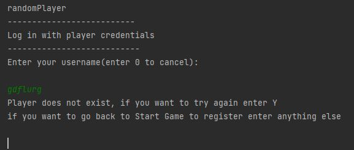
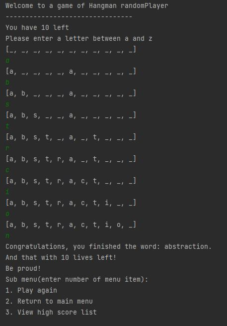
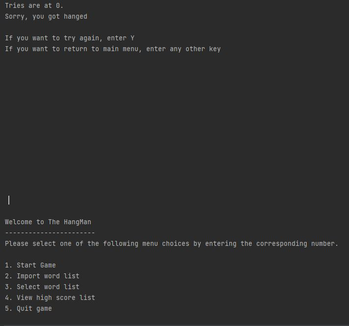

Test plan introduction
======================

This test-plan is meant to stand as a template for repeatable tests for the
system under test.

In the plans first iteration two Use cases will be selected for manual testing
and specification coverage used as a measurement of coverage.  
  
Furthermore Unit tests will be created to cover all five model classes in the
program, here line, class, branch and code coverage is used for measurement as
well as one deliberately failed test (more on this later).

Tester and repository information.
----------------------------------

-   Author: Tomas Marx-Raacz von Hidvég

-   Author university id: tendn09

-   Email: <tendn09@student.lnu.se>

-   Project under test:
    https://gitlab.lnu.se/1dv600/student/tendn09/assignment-3

Manual Test plan
================

Manual testing will be conducted on “UC 1 Start game” and “UC 1.1 Play game” on
the system under test in its current state. They are designed to cover the
specifications for these Use cases and as such follow the input specifications
of the code as a base. However, parts of the program, which we will soon see is
yet to be implemented and as such these tests are both white and black box
testing but from a manual standpoint.

These Use cases can be reviewed here:

| UC 1 Start Game                                                                              |                                                                                                                                                                                |
|----------------------------------------------------------------------------------------------|--------------------------------------------------------------------------------------------------------------------------------------------------------------------------------|
| Preconditions                                                                                | Start Game has been selected in main menu                                                                                                                                      |
| Post conditions                                                                              | Game menu is shown                                                                                                                                                             |
| **Main Scenario:**                                                                           |                                                                                                                                                                                |
| 1.                                                                                           | Starts when the user wants to begin a session of the hangman game.                                                                                                             |
| 2.                                                                                           | System prompts the user to choose to register a new player, log in, quit.                                                                                                      |
| 3.                                                                                           | Player choice to log in                                                                                                                                                        |
| 4.                                                                                           | System presents a list of registered users and requests username and password                                                                                                  |
| 5.                                                                                           | Player enters username and password.                                                                                                                                           |
| 6.                                                                                           | The system starts the game(see UC 1.1)                                                                                                                                         |
| *Repeat from step 2*                                                                         |                                                                                                                                                                                |
| **Alternate Scenarios:**                                                                     |                                                                                                                                                                                |
| 3.1                                                                                          | Player choice to register                                                                                                                                                      |
| 3.1.1                                                                                        | System requests user to input username and desired password and an option to cancel                                                                                            |
| 3.1.2                                                                                        | Player inputs username and desired password                                                                                                                                    |
| 3.1.3                                                                                        | Player chooses to cancel                                                                                                                                                       |
| 3.1.4 and 3.1.3.1                                                                            | Player is returned to Main scenario step 1.                                                                                                                                    |
| 3.2                                                                                          | Player choose to quit                                                                                                                                                          |
| 3.2.1                                                                                        | Go to UC 5                                                                                                                                                                     |
| 3.3                                                                                          | Invalid user choice                                                                                                                                                            |
| 3.3.1                                                                                        | The system presents an error message                                                                                                                                           |
| 3.3.2                                                                                        | Go to 2                                                                                                                                                                        |
| 5.1                                                                                          | Player chooses to cancel login                                                                                                                                                 |
| 5.1.1                                                                                        | Player is returned to Main scenario step 1                                                                                                                                     |
| UC 1.1 Play Game                                                                             |                                                                                                                                                                                |
| Precondition                                                                                 | Navigated through UC 1 with a valid username and password at login section.                                                                                                    |
| Postcondition                                                                                | Player wins a game and score is added to player username high-score                                                                                                            |
| **Main Scenario:**                                                                           |                                                                                                                                                                                |
| 1                                                                                            | System presents a line for each letter in the generated word as well as the number of tries(10) the player has left, requests a letter from player and an option to quit.      |
| 2                                                                                            | Player chooses a letter                                                                                                                                                        |
| 3                                                                                            | Correct letter, system fills the corresponding line with the letter, prints it and requests another letter from the player and the option to quit                              |
| *Step 2 and 3 repeats until the word is completed, the tries run out or player opts to quit* |                                                                                                                                                                                |
| 4                                                                                            | Correct word! System prints the full word, the username of the player and number of tries left.                                                                                |
|                                                                                              | Score is saved to user. Player is opted to play again, quit or view high-score.                                                                                                |
| 5                                                                                            | Player chooses to play again(Go to step 1)                                                                                                                                     |
| **Alternate Scenarios:**                                                                     |                                                                                                                                                                                |
| 2.1 and 5.1                                                                                  | Player opts to quit                                                                                                                                                            |
| 2.1.1 or 5.1.1                                                                               | Go to main menu                                                                                                                                                                |
| 2.2                                                                                          | Input is not a letter(and not quit option)                                                                                                                                     |
| 2.2.1                                                                                        | An error message is printed and user is asked to try again.                                                                                                                    |
| 4.1                                                                                          | Player runs out of tries without finishing the word. System asks if player wants to play again or quit.                                                                        |
| 4.1.1                                                                                        | Player opts to quit(return to main menu)                                                                                                                                       |
| 4.1.2                                                                                        | Player opts to try again(go to main scenario step 1)                                                                                                                           |
| 5.2                                                                                          | Player chooses to play again(go to main scenario step 1)                                                                                                                       |
| 5.3                                                                                          | Player chooses to view high-score                                                                                                                                              |
| 5.3.1                                                                                        | Go to UC 4                                                                                                                                                                     |

Test cases for UC 1
-------------------

| TC 1:1 – Main scenario |                                                                                                                                                                  |
|------------------------|------------------------------------------------------------------------------------------------------------------------------------------------------------------|
| Reference              | UC 1 Start game – Main scenario                                                                                                                                  |
| Description            | Test is meant to test the entrance to the program as well as login and register features.                                                                        |
| Preconditions          | A user has started the program and chosen “Start Game” in main menu on a fresh start of the program                                                              |
| Test-steps             | User inputs number 1 on the keyboard and presses enter to select login                                                                                           |
| Result description     | The test should be concluded with the system transporting the user to UC 1.1 with the welcoming string: “Welcome to a game of Hangman”                           |
| Checkboxes             | System accepts 1 as the path to login. System accepts “randomPlayer” as valid login name and continues. System accepts “1234” as a valid password and continues. |
| Comments               |                                                                                                                                                                  |

1.  System asks for username input.

2.  User inputs “randomPlayer” and presses enter

3.  System asks for password input.

4.  User inputs “1234” and presses enter

5.  System redirects to UC 1.1 Play Game

| TC 1:2 – Failed login and cancel login |                                                                                                                                                                                                                                                                                                                                                      |
|----------------------------------------|------------------------------------------------------------------------------------------------------------------------------------------------------------------------------------------------------------------------------------------------------------------------------------------------------------------------------------------------------|
| Reference                              | UC 1:5.1 Start game – cancel login. UC 1:5.1.1 Start game – redirect to Start Game menu And wrongful login input                                                                                                                                                                                                                                     |
| Description                            | Test is meant to test the authentication part of the program for what happens when user opts to cancel or fails to input correct name or password.                                                                                                                                                                                                   |
| Preconditions                          | A user has started the program and chosen “Start Game” in main menu on a fresh start of the program                                                                                                                                                                                                                                                  |
| Test-steps                             | Wrong username:                                                                                                                                                                                                                                                                                                                                      |
| Result description                     | In the first subtest a wrong input is entered for username, the user is presented an error message that player does not exist. And asked to retry or cancel. In the second subtest the password is wrong and same options apply but the message mentions that password is wrong with an option to cancel. Cancel should redirect to Start Game menu. |
| Checkboxes                             | System accepts 1 as the path to login. System does not accept anything but “randomPlayer” as valid username and asks player to try again or cancel. System does not accept anything but “1234” as a valid password asks player to try again or cancel.                                                                                               |
| Comments                               |                                                                                                                                                                                                                                                                                                                                                      |

6.  User inputs number 1 on the keyboard and presses enter to select login

7.  System asks for username input

8.  User inputs anything else than “randomPlayer” and “0” and presses enter.

9.  System presents error that player does not exists and asks user if he wants
    to try again (“y input) or cancel

10. User inputs anything but “y” or “Y” and presses enter to cancel login.

Wrong password:

1.  User inputs number 1 on the keyboard and presses enter login.

2.  System asks for username input.

3.  User inputs “randomPlayer” and presses enter.

4.  System asks for password input.

5.  User inputs anything but “1234” or “0” (zero) and presses enter

6.  System presents error message that password was wrong and gives player a
    choice of trying again(“y”) or cancel.

7.  User inputs anything but “y” or “Y” to cancel login.

| TC 1:3 – Register player |                                                                                                                                                                                                          |
|--------------------------|----------------------------------------------------------------------------------------------------------------------------------------------------------------------------------------------------------|
| Reference                | UC 1:3.1 Start game – Register UC 1:3.1.1 Start game – Register – request input UC 1:3.1.2 Start game – Register – input info UC 1: 3.1.2.1 Start game – Register -Redirect to Start Game menu.          |
| Description              | Test is meant to test a successful Register part of the program to input a new user                                                                                                                      |
| Preconditions            | A user has started the program and chosen “Start Game” in main menu on a fresh start of the program                                                                                                      |
| Test-steps               | Wrong username:                                                                                                                                                                                          |
| Result description       | The result of this test should input a username and password which is at step 4 presented for the User and then save it to the program so it can be used to log in and then redirect to Start Game menu. |
| Checkboxes               | System accepts 2 as the path to Register. System accepts anything but “0” (zero) as username. System accepts anything but “0” (zero) as password.                                                        |
| Comments                 |                                                                                                                                                                                                          |

8.  User inputs number 2 on the keyboard and presses enter to select Register

9.  System requests user to input username

10. User inputs anything else than “0” (zero) and presses enter to enter
    username.

11. System requests user to input password

12. User enters anything but “0” (zero) and presses enter to choose password

13. User is presented with entered info and presses any input and enter to
    return to game menu.

| TC 1:4 – Register player - Cancel |                                                                                                                                                                                                             |
|-----------------------------------|-------------------------------------------------------------------------------------------------------------------------------------------------------------------------------------------------------------|
| Reference                         | UC 1:3.1 Start game – Register UC 1:3.1.1 Start game – Register – request info UC 1:3.1.3 Start game – Register – cancel UC 1:3.1.3.1 Start game – Register – redirect to Start game menu.                  |
| Description                       | Test is meant to test the entrance to the program as well as login and register features.                                                                                                                   |
| Preconditions                     | A user has started the program and chosen “Start Game” in main menu on a fresh start of the program                                                                                                         |
| Test-steps                        | Username cancel:                                                                                                                                                                                            |
| Result description                | The tests, if successful should cancel the register process and bring the user back to the Start Game menu.                                                                                                 |
| Checkboxes                        | System accepts 2 as the path to Register. System accepts “0” input on username as cancel and redirects to Start Game menu. System accepts “0” input on password as cancel and redirects to Start Game menu. |
| Comments                          |                                                                                                                                                                                                             |

14. User inputs number 2 on the keyboard and presses enter to select Register

15. System requests user to input username

16. User inputs “0” (zero) and presses enter to exit Register part.

Password cancel:

1.  User inputs number 2 on the keyboard and presses enter to select Register

2.  System requests user to input username

3.  User inputs anything but “0” (zero) and presses enter

4.  System requests user to input password

5.  User inputs “0” and presses enter.

| TC 1:5 – Quit option |                                                                                                                                                                                                                                   |
|----------------------|-----------------------------------------------------------------------------------------------------------------------------------------------------------------------------------------------------------------------------------|
| Reference            | UC 1:3.2 Start game – Quit to main menu UC 1:3.2.1 Start game – redirect to Main menu.                                                                                                                                            |
| Description          | Test to verify that the quit option in the Start Game menu works according to specifications.                                                                                                                                     |
| Preconditions        | A user has started the program and chosen “Start Game” in main menu on a fresh start of the program                                                                                                                               |
| Test-steps           | Confirmed quit:                                                                                                                                                                                                                   |
| Result description   | The first subtest, if successful should redirect user back to main menu screen. The second subtest, if successful should redirect user back to Start game menu.                                                                   |
| Checkboxes           | System accepts 3 as the path to Quit to main menu. System accepts “y” or “Y” input on confirm as quit and redirects to Main menu. System accepts anything but “y” or “Y” as cancel for quit command redirects to Start Game menu. |
| Comments             |                                                                                                                                                                                                                                   |

6.  User inputs number 3 on the keyboard and presses enter to select Quit game.

7.  System asks for confirmation that the player wants to quit the Start Game
    menu.

8.  User inputs “y” or “Y” to confirm

Unconfirmed quit:

1.  User inputs number 3 on the keyboard and presses enter to select Quit game.

2.  System asks for confirmation that the player wants to quit the Start Game
    menu.

3.  User inputs anything but “y” or “Y” to cancel.

| TC 1:6 – Invalid Start Game menu input |                                                                                                                                         |
|----------------------------------------|-----------------------------------------------------------------------------------------------------------------------------------------|
| Reference                              | UC 1:3.3 -Start game – Invalid input UC 1:3.3.1 – Start Game – error message UC 1:3.3.2 – Start Game – redirect back to UC1 start       |
| Description                            | Test to check if other input in Start Game menu renders the correct result                                                              |
| Preconditions                          | A user has started the program and chosen “Start Game” in main menu on a fresh start of the program                                     |
| Test-steps                             | Confirmed quit:                                                                                                                         |
| Result description                     | If successful, the test should have the system render an error message about wrong input and redirect user back to Start Game menu.     |
| Checkboxes                             | System only accepts 1-3 as the correct Start Game paths. System otherwise posts an error message and redirects back to Start Game menu. |
| Comments                               |                                                                                                                                         |

4.  User inputs anything but “1”, “2”, or “3”.

5.  System posts an error message telling user that input was wrong and
    redirects back to Start Game menu.

### UC 1 and TC 1 Matrix

The matrix for the Test cases coverage of the different specifications in UC 1
are presented below in a table.

| TC -\> UC | 1.1 | 1.2 | 1.3 | 1.4 | 1.5 | 1.6 |
|-----------|-----|-----|-----|-----|-----|-----|
| 1: main   | x   |     |     |     |     |     |
| 1:3.1     |     |     | x   | x   |     |     |
| 1:3.1.1   |     |     | x   | x   |     |     |
| 1:3.1.2   |     |     | x   |     |     |     |
| 1:3.1.3   |     |     |     | x   |     |     |
| 1:3.1.2.1 |     |     | x   |     |     |     |
| 1:3.1.3.1 |     |     |     | x   |     |     |
| 1:3.2     |     |     |     |     | x   |     |
| 1:3.2.1   |     |     |     |     | x   |     |
| 1:3.3     |     |     |     |     |     | x   |
| 1:3.3.1   |     |     |     |     |     | x   |
| 1:3.3.2   |     |     |     |     |     | x   |
| 1:5.1     |     | x   |     |     |     |     |
| 1:5.1.1   |     | x   |     |     |     |     |
|           |     |     |     |     |     |     |

Test cases for UC 1.1.
----------------------

| TC 2:1 – Main scenario |                                                                                                                                                                                                                                                                                                                                                                          |
|------------------------|--------------------------------------------------------------------------------------------------------------------------------------------------------------------------------------------------------------------------------------------------------------------------------------------------------------------------------------------------------------------------|
| Reference              | UC 1.1 Play game – Main scenario UC 1.1:5.2 Play game – Play again                                                                                                                                                                                                                                                                                                       |
| Description            | Test is meant to follow the main scenario of the UC 1.1 successful scenario to confirm it is working as intended.                                                                                                                                                                                                                                                        |
| Preconditions          | An user has successfully traversed UC 1 login procedure to successfully start a game of Hangman.                                                                                                                                                                                                                                                                         |
| Test-steps             | System presents 11(eleven) lines, number if tries left and instructions to insert a letter between “a” and “z” in the alphabet. As well as option to quit “0”.                                                                                                                                                                                                           |
| Result description     | The test is concluded with user presented with a congratulations view where the full word is printed as well as tries left and a menu for further options. System also has to successfully transport user back to start with the option “1”.                                                                                                                             |
| Checkboxes             | System presents lines in reference of the word correctly(abstraction, 11 letters) and the option to quit. System successfully exchanges a correct letter input in the blank lines. System correctly prints the word entered and tries left after input is finished. System prints the menu as stated and redirects back to start of UC 1.1 correctly if “1” is selected. |
| Comments               |                                                                                                                                                                                                                                                                                                                                                                          |

1.  User inputs letter “a” and presses enter to submit it

2.  System prints same lines but exchanges line 1 and 6 with the letter “a”

3.  Repeat steps 2 and 3 with the letters “b”, “s”, “t”,”r”,”c”,”i”, “o” and “n”

4.  System prints a string that you have finished the word “abstraction” and
    prints the number of tries left(10).  
    Furthermore the system presents options to play again(1), return to main
    menu(2) or view high score(3)

5.  User inputs 1 and presses enter to play again

6.  System redirects to start of UC 1.1 main scenario start.

| TC 2:2 – Option to quit |                                                                                                                                        |
|-------------------------|----------------------------------------------------------------------------------------------------------------------------------------|
| Reference               | UC 1.1:2.1 Play game – opt to quit UC 1.1:2.1.1 Play game – Go to main menu                                                            |
| Description             | This test is meant to confirm that the option to quit from the running game works as intended.                                         |
| Preconditions           | UC 1.1 is started and user is presented with the empty lines.                                                                          |
| Test-steps              | User inputs “0” instead of a letter and presses enter to choose to quit.                                                               |
| Result description      | The test should be concluded with the system transporting the user to UC 1.1 with the welcoming string: “Welcome to a game of Hangman” |
| Checkboxes              | System accepts “0” as command to quit to menu System successfully redirects user to main menu when option to quit is selected          |
| Comments                |                                                                                                                                        |

7.  System redirects user to main menu.

| TC 2:3 – Wrongful input |                                                                                                                                                           |
|-------------------------|-----------------------------------------------------------------------------------------------------------------------------------------------------------|
| Reference               | UC 1.1:2.2 Play game – Wrong input UC 1.1:2.2.1 Play game – error message                                                                                 |
| Description             | The test is meant to confirm that the check for inputs for anything but the “a” to “z” letters and “0” is working and an error is printed.                |
| Preconditions           | UC 1.1 is started and user is presented with the empty lines.                                                                                             |
| Test-steps              | User inputs anything but “a” to “z” in the alphabet or “0” when entering letters. For the purpose of this test the letters “å”, “\*” and “4” is selected. |
| Result description      | The test is concluded when a wrongful option renders the above-mentioned error except for correct inputs.                                                 |
| Checkboxes              | System does not accept “å”, “\*” and “4” as correct inputs System presents an error and asks user to try again with no tries deducted.                    |
| Comments                |                                                                                                                                                           |

8.  System prints an error message telling the user that the input is faulty and
    the user is asked to try again.

| TC 2:4 – Wrong letter and failed attempt |                                                                                                                                                                                                                                                                   |
|------------------------------------------|-------------------------------------------------------------------------------------------------------------------------------------------------------------------------------------------------------------------------------------------------------------------|
| Reference                                | UC 1.1:4.1 Play game – Player runs out of tries UC 1.1:4.1.1 Play game – redirect to main menu UC 1.1:4.1.2 Play game – redirect to try again.                                                                                                                    |
| Description                              | The test is meant to confirm that the check for inputs for anything but the “a” to “z” letters and “0” is working and an error is printed.                                                                                                                        |
| Preconditions                            | UC 1.1 is started and user is presented with the empty lines.                                                                                                                                                                                                     |
| Test-steps                               | User inputs “e” and presses enter to select that letter                                                                                                                                                                                                           |
| Result description                       | The test is concluded successfully if a failed attempt at a word renders the correct output and options to follow as well as redirects to the options.                                                                                                            |
| Checkboxes                               | System deducts and prints number of tries after each failed attempt. When tries reach 0 System prints that the attempt is failed and player is “hanged” System presents option to try again or return to main menu. System redirects correctly to option selected |
| Comments                                 |                                                                                                                                                                                                                                                                   |

9.  System presents blank lines again, telling the user the letter does not
    exist, deducts 1 try and prints number left.

10. User repeats step 1 until tries run out.

11. System presents the message “Sorry, you are hanged” and the option to try
    again by pressing “y” or “Y”.

12. User presses “y” and enter to try again

13. System returns user to start of UC 1.1

14. User presses anything but “y” and presses enter to return to menu

15. System redirects user back to main menu.

| TC 2:5 – Alternate menu redirects after finishing a word |                                                                                                                                                                           |
|----------------------------------------------------------|---------------------------------------------------------------------------------------------------------------------------------------------------------------------------|
| Reference                                                | UC 1.1:5.1 Play game – opt to quit UC 1.1:5.1.1 Play game – redirect to main menu UC 1.1:5.3 Play game – opt to view high-score UC 1.1:5.3.1 Play game – redirect to UC 4 |
| Description                                              | The test is to confirm that alternate redirects after a finished game of Hangman is working as intended.                                                                  |
| Preconditions                                            | Finished a game of hangman with tries left.                                                                                                                               |
| Test-steps                                               | Quit to main menu:                                                                                                                                                        |
| Result description                                       | The test is concluded when a wrongful option renders the above-mentioned error except for correct inputs.                                                                 |
| Checkboxes                                               | System does not accept “å”, “\*” and “4” as correct inputs System presents an error and asks user to try again with no tries deducted.                                    |
| Comments                                                 |                                                                                                                                                                           |

16. System presents options to play again, quit (“2”) and view high score (“3”).

17. User inputs “2” and presses enter to return to main menu

18. System redirects to main menu

View High score:

1.  System presents options to play again, quit (“2”) and view high score (“3”).

2.  User inputs “3” and presses enter to return to view high score list.

3.  System redirects to high score view (UC4).

### UC 1.1 and TC 2 Test matrix:

>   The test matrix for TC 2 coverage of UC scenarios.

| TC -\> UC | 2:1 | 2:2 | 2:3 | 2:4 | 2:5 |
|-----------|-----|-----|-----|-----|-----|
| 1.1 main  | x   |     |     |     |     |
| 1.1:2.1   |     | x   |     |     |     |
| 1.1:2.1.1 |     | x   |     |     |     |
| 1.1:2.2   |     |     | x   |     |     |
| 1.1:2.2.1 |     |     | x   |     |     |
| 1.1:4.1   |     |     |     | x   |     |
| 1.1:4.1.1 |     |     |     | x   |     |
| 1.1:4.1.2 |     |     |     | x   |     |
| 1.1:5.1   |     |     |     |     | x   |
| 1.1:5.1.1 |     |     |     |     | x   |
| 1.1:5.2   | x   |     |     |     |     |
| 1.1:5.3   |     |     |     |     | x   |
| 1.1:5.3.1 |     |     |     |     | x   |

Manual testing results
----------------------

>   Presented below are the results of the manual test cases.

>   First the matrixes will be presented again but altered to see which tests
>   rendered succeeded and which tests failed. After that a section for each
>   test failed will be presented and motivations as to why they failed.
>   Furthermore, suggestions for how to correct the system to adhere to the
>   tests will be presented.

### UC 1 test cases

Below is the matrix for UC1 and TC1. A green 1 will be shown for tests that pass
and a red 0 for the tests that fail.

| TC -\> UC | 1.1 | 1.2 | 1.3 | 1.4 | 1.5 | 1.6 |
|-----------|-----|-----|-----|-----|-----|-----|
| 1: main   | 1   |     |     |     |     |     |
| 1:3.1     |     |     | 1   | 1   |     |     |
| 1:3.1.1   |     |     | 1   | 1   |     |     |
| 1:3.1.2   |     |     | 1   |     |     |     |
| 1:3.1.3   |     |     |     | 1   |     |     |
| 1:3.1.2.1 |     |     | 1   |     |     |     |
| 1:3.1.3.1 |     |     |     | 1   |     |     |
| 1:3.2     |     |     |     |     | 1   |     |
| 1:3.2.1   |     |     |     |     | 1   |     |
| 1:3.3     |     |     |     |     |     | 0   |
| 1:3.3.1   |     |     |     |     |     | 0   |
| 1:3.3.2   |     |     |     |     |     | 0   |
| 1:5.1     |     | 0   |     |     |     |     |
| 1:5.1.1   |     | 0   |     |     |     |     |
|           |     |     |     |     |     |     |

As can be seen by this initial table we have several failed test cases that do
not present the expected results. They will now be presented in turn with
specifics.

#### Failed test 1.2

Now the first part of this test, concerning the username was successful as is
shown by the following image and the redirect when choosing anything but the “y”
is also working as intended:

However, the second part concerning the passwords renders an entirely different
result:

The program exits immaturely instead of prompting the desired response with the
option to cancel or try again.

It becomes clear that the developers in this case have yet to implement this
part and as such the program just chooses to exit as no other redirects exist
from this point.

#### Failed test 1.6

Yet again in this point we have a case when one of the subtests work when an
incorrect menu number is unput. This is indeed the desired result:

However, if one enters letters or a full string the results are completely
different:

The program exits due to a input mismatch and tells us that the developers in
this case did not account for a user input being anything else than a number.
This will have to be corrected to reach a test completion.

### UC 1.1 test cases.

Below is the matrix for UC1 and TC1. A green 1 will be shown for tests that pass
and a red 0 for the tests that fail.

| TC -\> UC | 2:1 | 2:2 | 2:3 | 2:4 | 2:5 |
|-----------|-----|-----|-----|-----|-----|
| 1.1 main  | 0   |     |     |     |     |
| 1.1:2.1   |     | 0   |     |     |     |
| 1.1:2.1.1 |     | 0   |     |     |     |
| 1.1:2.2   |     |     | 0   |     |     |
| 1.1:2.2.1 |     |     | 0   |     |     |
| 1.1:4.1   |     |     |     | 1   |     |
| 1.1:4.1.1 |     |     |     | 0   |     |
| 1.1:4.1.2 |     |     |     | 0   |     |
| 1.1:5.1   |     |     |     |     | 1   |
| 1.1:5.1.1 |     |     |     |     | 1   |
| 1.1:5.2   | 1   |     |     |     |     |
| 1.1:5.3   |     |     |     |     | 1   |
| 1.1:5.3.1 |     |     |     |     | 1   |

As can be seen in the table above several of the test cases failed and will be
presented below.

#### Failed TC 2.1

Again, we have a partly successful and partly failing test case. In large the
test concluded successfully but the devil is in the details in this case:

The test here shows that it renders the letters correctly but do not render
remaining tries.

It also renders the finishing screen and following menu correctly as well as the
follow-up choice of playing again:

To make this Test case adhere to the User case specification the tries will have
to be included in all the iterations of the game to correctly state the number
of tries left.

#### Failed TC 2.2

This test failed completely as revealed here:

First and foremost the option to quit during a running game is not presented.  
Furthermore input of “0” does absolutely nothing and is considered a faulty
input in consideration to the word input as presented here:

It becomes clear at this point that the developers need to revisit this part of
the code and implement recognition of “0” input as a quit game command as well
as the input of anything but a-z inputs as not connected to tries against the
word.

#### Failed TC 2.3

This test case is connected slightly towards the 2.3.2.2 mentioned explanation
as to why the test failed.

No recognition of input at this stage has been implemented by the developer and
as such this test case fail and are instead directly connected to the word
tries. This needs to be implemented for this test to be completed.

#### Failed TC 2.4

This test partly succeeds in that it does indeed decrease the number of tries
(but as mentioned previously does not print the current number) and prints the
message prompting the user to try again or quit to main menu.

That is however where it ends as far as the correctness towards specification
goes. The system, instead of letting the player choose what to do redirects the
user directly to the main menu:

The developers need to revisit this section and implement the choice section for
this test to pass.

### Manual test cases reflection and conclusion

From the previous sections we have conducted the tests specified towards the use
cases we can conclude that as it stands the system is not fully implemented.
Furthermore, some errors in input handling have been uncovered and will have to
be corrected for the final delivery.

Manual testing as a testing form is according to the author tedious, but
necessary when it comes to view classes where user input must be tested, and
different inputs are to be expected. It is also relevant to see that a program
renders the views as is to be expected according to use cases. The testing
parameters are not exclusively “right” or “wrong” based but can be experience
based where an automated test cannot present the information needed for
developers.

A fresh set of eyes might be relevant to have here as well as the developer in
charge of the systems construction might device tests to confirm rather than
properly test the system for unexpected behaviour.

Automated unit tests.
=====================

The automated tests have been constructed using JUnit 5 to test these model
classes within the system:

1.  HangmanPlayer

2.  HangmanPlayerList

3.  HangmanWord

4.  HangmanWordList

5.  ListOfWordList

They have been constructed to test the response of methods inside these classes
for inputs sent by the main program as well as when these inputs do not exist.

These tests are constructed from a white boxing standpoint as the code is in the
testers possession and as such no mocks are needed to imitate program behaviour.

Furthermore 1 test have been constructed a fictive non implemented method in the
HangmanPlayerList class to imitate a failed test.  
This test is constructed to get a string with name and score of a player within
the list with an input parameter of the name string.

23 tests with multiple assertions are divided into 5 test classes and can be
reviewed here:

<https://gitlab.lnu.se/1dv600/student/tendn09/assignment-3/-/tree/master/test/tests/hangman>

The uncompleted code for this test is the following:

The test designed to fail looks like this:

It is expected to, after adding a freshly created player with the username
“tomas” and with a score of 0(freshly created) to render the string “tomas 0”
but instead, due to missing implementation will render an empty string.

Automated test results
----------------------

The tests conducted are presented below in two images with a slimmed down
coverage report:

Here we can see that all tests par 1 succeed as expected as the method is not
fully implemented (or rather the code to implement it is commented out).

And the coverage is 100% as to class, method, line, and branch for the model
classes as presented in the next image:

The full coverage report can be accessed here in HTML generated by IntelliJ:

<https://gitlab.lnu.se/1dv600/student/tendn09/assignment-3/-/tree/master/test-plan-and-report/generated_coverage_report>

This folder needs to be downloaded and run like a homepage on your browser.

Automated test summary and reflection.
--------------------------------------

Automated tests are a very good way for developers to test the behaviour of the
constructed classes. The behaviour and the parameters expected are put into the
test classes and the results expected or not expected are checked.

However, in a testing standpoint, the sort of white box testing can be a problem
since these tests are constructed by the developers to test classes constructed
by the same developers.  
Although this way guarantees that what you expect happens, the potential for
“blindness” for unexpected parameters are quite large when testing your own
code.

As such black box testing, conducted by someone else might be preferred to
uncover unexpected behaviour rather than confirming expected behaviour.
